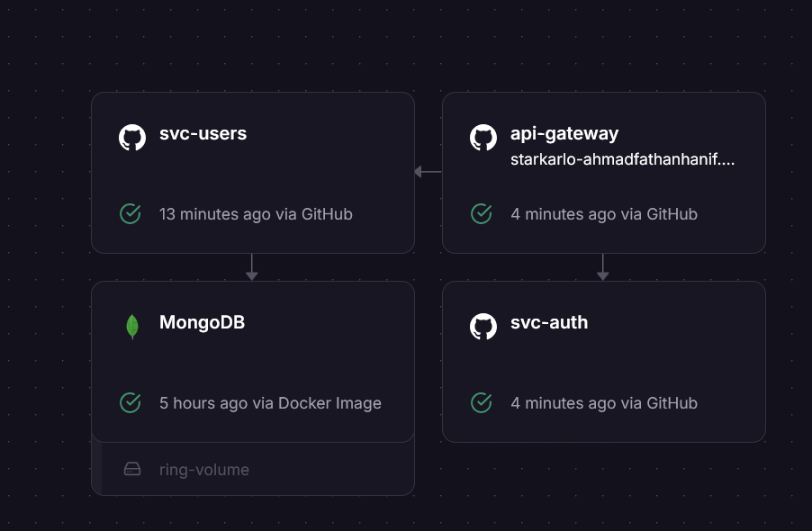

## Content

- API Gateway
- Auth Service
- Users Service

## Project Setup

1. Copy this repository
2. Copy the the environment example file, then rename to .env
3. Setup the infrastructure via docker compose "docker compose up -d"
4. Open each service, then install the dependencies via "npm install"
5. Run each service as dev mode "npm run start:dev" or as production "npm run build && npm run start:prod"

## API Documentation

Can be accessed via http://localhost:8000/api (default port for api gateway is 8000)

Demo documentation via: https://starkarlo-ahmadfathanhanif.up.railway.app/api

Demo application will be remove on 1 December 2024

## Architecture Preview

